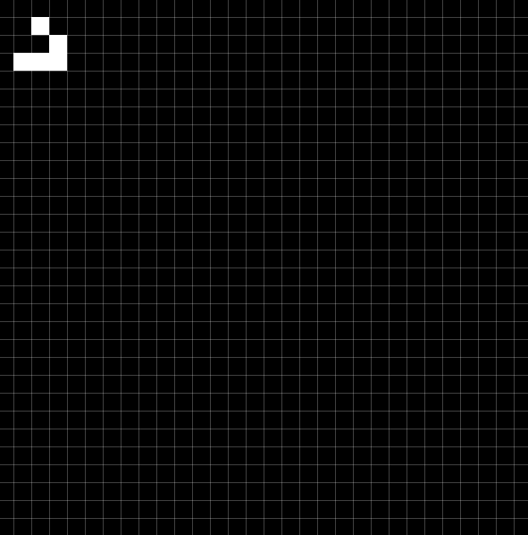

# Conway's Game of Life

This is my attempt at making a GoL visualizer in C++ using the SFML library. All up, this took me about 2.5 hours to make and it simulates the board state via [multidimensional discrete convolutions](https://en.wikipedia.org/wiki/Multidimensional_discrete_convolution).

